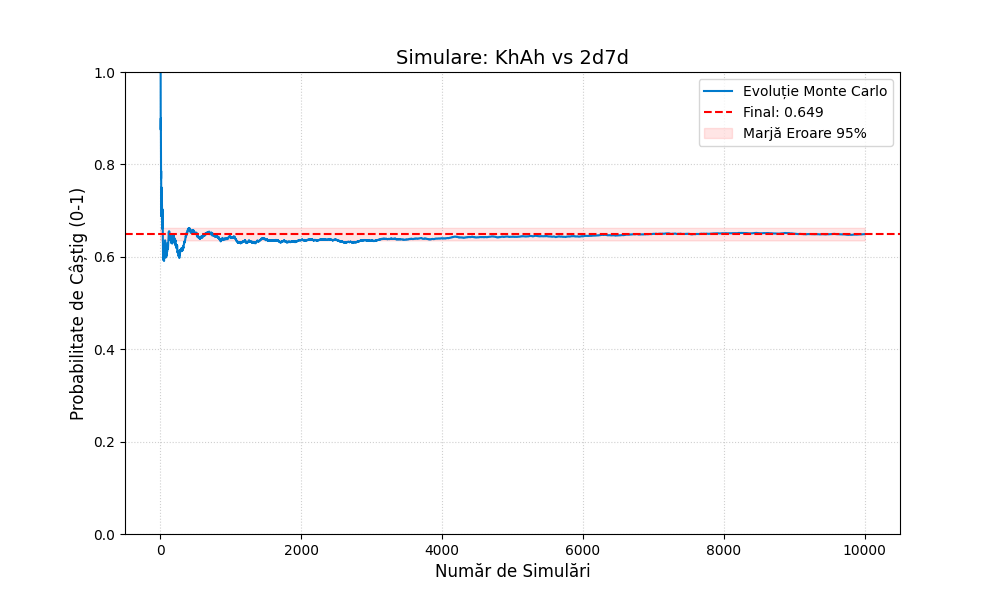
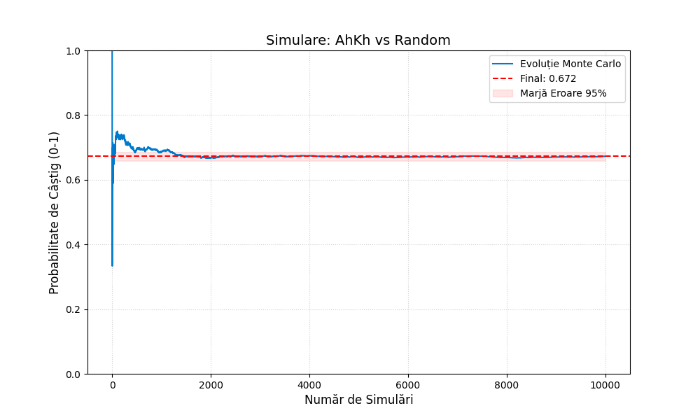
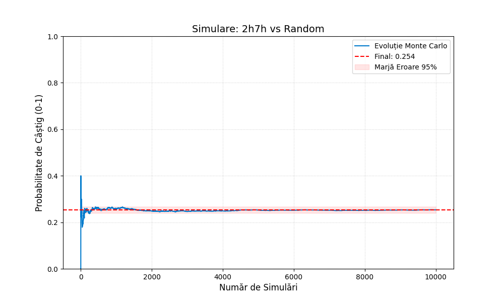
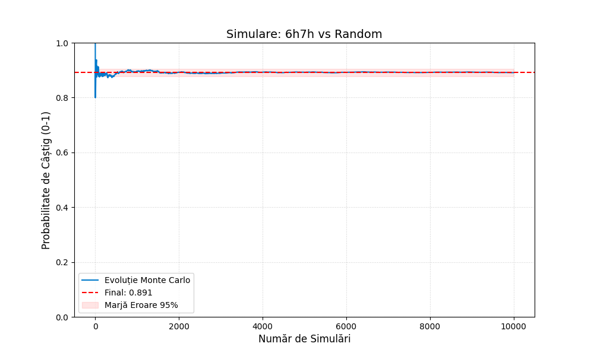

# Poker Monte Carlo Simulator ♠️♥️

Acest proiect este o aplicație a simulărilor de tip Monte Carlo. Ne folosim de simulare pentru a prezice cât de bună este o anumită mână de poker la un moment dat, mai ales cand este greu/imposibil de calculata sansa reala.

## 1. Despre "Magia Neagră" a Simulării

Teoretic proiectul nu are vreo aplicație practică în lumea reală, dar demonstrează perfect cum funcționează simulările de tip Monte Carlo. Personal încă ni se pare magie neagră cum este de multe ori irelevantă dificultatea/complexitatea a ce simulezi în formula care îți spune de câte simulări ai nevoie pentru a obține o marjă de eroare de maxim x%.

Simulatorul se bazează pe **LEGEA NUMERELOR MARI**: pe măsură ce numărul de simulări crește, media scade, convergând la probabilitatea reală în timp (adică la cea teoretică).

## 2. De ce Monte Carlo și nu altceva?

De ce Monte Carlo? Pentru că numărul total de permutări posibil dintr-un pachet de 52 de cărți este $52!$, un număr absolut inimaginabil de mare. Deci, calculul brute-force este inaccesibil.

Dar dacă folosim o simulare de genul acesta, putem după 100.000 de mâini să spunem cu practic certitudine (99.9% precizie) un răspuns *corect*. Teoretic nu e corect corect, dar se înțelege ideea. Nu va exista niciodată un outlier atât de puternic pe care să îl omitem, întrucât fiecare simulare aduce o cantitate fixă de date în aplicație.

## 3. Matematica din Spate (Inegalitatea Hoeffding)

Am aplicat **Inegalitatea Hoeffding** direct în cod, trântind-o fără nici un fel de gând. Glumesc, am folosit-o pentru a afla o aproximare foarte bună la marja de eroare.

Astfel, legat și de ce am zis mai sus, pentru a reduce eroarea de 10 ori, trebuie să mărești numărul de simulări de 100 de ori (relație pătratică), indiferent dacă simulezi aruncarea unei monede sau o mână complexă de poker cu 7 cărți.

## 4. Tehnologii (Stack-ul Nostru)

Am folosit **Python** pentru simplitatea și rapiditatea implementării, cât și pentru că are o librării foarte utile precum `matplotlib`. (și pentru că l-am folosit la laborator :PP).

---

## 5. Dependințe

Codul folosește biblioteci standard din Python (`random`, `math`, `itertools`, `collections`), deci nu ai nevoie de mare lucru. Singura librărie externă este **Matplotlib**.

Instaleaz-o rapid cu pip:
```bash
pip install matplotlib
```

## 6. Cum rulezi?

Scrii in terminal
```bash
python main.py
```
apoi urmezi instructiunile de pe ecran. Atat 👍.

## Poze simulari :D






<br><br>
# Breviar Matematic: Poker Monte Carlo
Acest document detaliază conceptele matematice utilizate în motorul de simulare.

## 1. Calculul de Equity (Probabilitatea de Câștig)

În cadrul simulării, "Equity-ul" este media aritmetică a rezultatelor obținute. Deoarece un câștig valorează 1 punct, o egalitate (split pot) 0.5 puncte și o înfrângere 0 puncte, formula folosită este:

$$E = \frac{W + 0.5 \times T}{N}$$

Unde:
* $E$ = Equity (procentajul final).
* $W$ = Numărul de victorii (Wins).
* $T$ = Numărul de egalități (Ties/Splits).
* $N$ = Numărul total de simulări.

---

## 2. Legea Numerelor Mari (LLN)

Simularea se bazează pe **Legea Slabă a Numerelor Mari**. Aceasta garantează că, pe măsură ce dimensiunea eșantionului ($n$) crește, media eșantionului ($\overline{X}_n$) converge în probabilitate către valoarea așteptată teoretică ($\mu$).

$$\lim_{n \to \infty} P\left( | \overline{X}_n - \mu | < \varepsilon \right) = 1$$

**În cod:** Aceasta este logica din spatele buclei `for i in range(n_sims)`, unde acumulăm rezultate pentru a aproxima realitatea.

---

## 3. Inegalitatea Hoeffding (Marja de Eroare)

Pentru a calcula intervalul de încredere (zona roșie de pe grafic) și a estima precizia simulării, am folosit **Inegalitatea Hoeffding**.

Pentru o variabilă aleatoare mărginită în intervalul $[0, 1]$ (cum este șansa de câștig la poker), probabilitatea ca media estimată să devieze de la media reală cu mai mult de $\varepsilon$ este:

$$P(|\overline{X} - E[\overline{X}]| \ge \varepsilon) \le 2e^{-2n\varepsilon^2}$$

Pentru un nivel de încredere de 95% ($\alpha = 0.05$), putem deriva formula marjei de eroare ($\varepsilon$) folosită în cod:

$$\varepsilon \approx \sqrt{\frac{\ln(2/\alpha)}{2n}} \approx \frac{1.36}{\sqrt{n}}$$

**Explicație practică:**
Formula arată o relație invers pătratică.
* Dacă $n = 100$, eroarea este $\approx 13.6\%$.
* Dacă $n = 10,000$, eroarea scade la $\approx 1.36\%$.
* Pentru a reduce eroarea de 10 ori, trebuie să creștem numărul de simulări de 100 de ori ($10^2$).

---

## 4. Combinatorică (Complexitatea Spațiului de Stări)

Motivul pentru care folosim o abordare stocastică (Monte Carlo) în loc de una deterministă (Brute Force) este dimensiunea spațiului de stări.

Numărul de permutări ale unui pachet de cărți este:

$$P_{52} = 52! \approx 8.06 \times 10^{67}$$

Chiar și într-un scenariu simplificat (Head's Up, Preflop), numărul de board-uri posibile (5 cărți comune din 48 rămase) este dat de combinări:

$$C(48, 5) = \frac{48!}{5!(48-5)!} = 1,712,304$$

Deși calculabil pentru un singur scenariu, într-o aplicație reală unde range-urile adversarilor sunt necunoscute, complexitatea crește exponențial, făcând simularea singura opțiune viabilă în timp real.

---


### Descriere Funcții

**Structuri de Date & Parsing**

* `class Card(rank, suit)`
    * **Input/Output:** (rank, suit) $\to$ Object
    * **Logică:** Stochează rangul și culoarea; include metode de afișare (`__repr__`) și comparare (`__eq__`, `__hash__`).

* `create_deck()`
    * **Input/Output:** None $\to$ List[Card]
    * **Logică:** Generează pachetul complet de 52 de cărți (produs cartezian Rank x Suit).

* `parse_hand(hand_str)`
    * **Input/Output:** String (ex: "Ah Ks") $\to$ List[Card]
    * **Logică:** Convertește textul utilizatorului în obiecte `Card`, eliminând caracterele inutile.

**Logică de Poker (Engine)**

* `get_rank_5(cards)`
    * **Input/Output:** List[Card] (exact 5) $\to$ (Int, List[int])
    * **Logică:** Calculează scorul unei mâini (de la Carte Mare la Chintă Roială) și returnează tuplul `(Categorie, Kicker)`.

* `evaluate_hand(cards)`
    * **Input/Output:** List[Card] (oricâte) $\to$ (Int, List[int])
    * **Logică:** Folosește `itertools.combinations` pentru a găsi cea mai bună combinație de 5 cărți din totalul disponibil.

**Simulare & UI**

* `run_simulation(hero, villain, board, n_sims)`
    * **Input/Output:** Strings $\to$ (Float, List[float])
    * **Logică:** Rulează algoritmul Monte Carlo. Simulează `n` jocuri completând board-ul aleatoriu și calculează procentul de câștig (Equity).

* `get_coach_advice(equity, vs_random)`
    * **Input/Output:** Float $\to$ String
    * **Logică:** Returnează un sfat textual (ex: "Joacă agresiv") bazat pe praguri procentuale de șansă.

* `run_poker_coach()`
    * **Input/Output:** Main Entry Point
    * **Logică:** Gestionează input-ul utilizatorului, apelează simularea și afișează graficul de evoluție (Matplotlib).

### 2. Structura Codului

```text
POKER-MONTE-CARLO/
├── 1. DATA_STRUCTURES
│   ├── Constants (SUITS, RANKS)
│   ├── Class Card (Model date)
│   ├── create_deck (Generator pachet)
│   ├── parse_hand (Input parser)
│   ├── get_rank_5 (Reguli Poker)
│   └── evaluate_hand (Optimizator mână)
│
├── 2. SIMULATION_ENGINE
│   └── run_simulation (Algoritm Monte Carlo)
│
└── 3. UI_AND_VISUALIZATION
    ├── get_coach_advice (Interpretare rezultate)
    └── run_poker_coach (Main Entry Point & Plotting)

